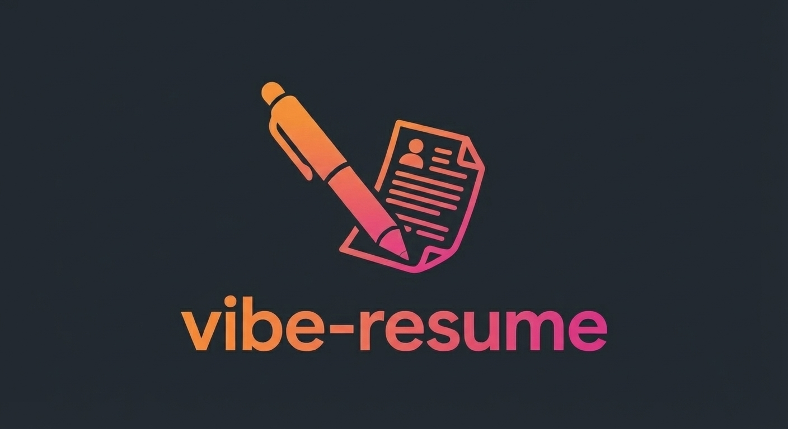

# Vibe Resume - AI-Powered LaTeX Resume Generator

An intelligent resume builder that uses AI to generate professional LaTeX resumes from natural language descriptions, uploaded PDFs, or images.



## Features

- **AI-Powered Generation** - Describe your experience in natural language and get a professionally formatted LaTeX resume
- **Multiple Input Methods**:
  - Type your experience directly
  - Upload existing resume (PDF or image)
  - Paste LinkedIn/Twitter profile URLs
- **Icons & Images Support**:
  - 30+ FontAwesome icons for contact info, social links, and skills
  - Upload profile photos and custom images
  - Visual icon picker with search and categories
  - TikZ-based skill bars and decorative elements
- **Live Preview** - See your PDF render in real-time as changes are made
- **LaTeX Editor** - Built-in code editor with syntax highlighting for manual tweaks
- **Version Control** - Checkpoint system to restore previous versions
- **Multiple Sessions** - Work on up to 5 different resumes simultaneously
- **Fast/PRO Modes** - Toggle between quick generation (Gemini Flash) and higher quality (Gemini Pro)
- **Dark/Light Theme** - Easy on the eyes, day or night
- **SyncTeX Support** - Click on PDF to jump to corresponding LaTeX source

## Tech Stack

**Backend:**
- Python/Flask
- Google Gemini AI (gemini-2.5-flash / gemini-3-pro-preview)
- pdflatex for PDF compilation
- PyPDF2 for PDF text extraction

**Frontend:**
- React 19 + Vite
- CodeMirror for LaTeX editing
- PDF.js for rendering
- Lucide React for icons

## Prerequisites

- Python 3.10+
- Node.js 18+
- LaTeX distribution (for PDF compilation):
  - **macOS**: `brew install --cask mactex-no-gui`
  - **Ubuntu**: `sudo apt install texlive-full`
  - **Windows**: Install [MiKTeX](https://miktex.org/)
- Google Gemini API key

## Installation

### 1. Clone the repository

```bash
git clone https://github.com/yourusername/latex-resume-generator.git
cd latex-resume-generator
```

### 2. Set up the backend

```bash
# Create virtual environment
python -m venv venv
source venv/bin/activate  # On Windows: venv\Scripts\activate

# Install dependencies
pip install -r requirements.txt

# Create .env file
echo "GEMINI_API_KEY=your_api_key_here" > .env
```

### 3. Set up the frontend

```bash
cd frontend
npm install
```

## Running the App

### Development Mode

**Terminal 1 - Backend:**
```bash
# From project root
source venv/bin/activate
python app.py
```
Backend runs on http://localhost:5050

**Terminal 2 - Frontend:**
```bash
cd frontend
npm run dev
```
Frontend runs on http://localhost:5173

### Production Build

```bash
cd frontend
npm run build
```

The built files will be in `frontend/dist/`. Configure your Flask app to serve these static files.

## Usage

1. **Start a new chat** - Click "+ New Chat" in the sidebar
2. **Describe your experience** - Type something like "Create a resume for a software engineer with 5 years of experience at Google"
3. **Or upload a file** - Drag and drop a PDF/image of your existing resume
4. **Review and edit** - Use the LaTeX editor to make manual adjustments
5. **Download** - Click the download button to get your PDF

### Adding Icons & Images

1. **Icons** - Click the "Icons" button to open the icon picker
   - Browse by category: Contact, Social, Professional, Tech
   - Search for specific icons
   - Click to add to your resume elements
2. **Images** - Click the "Image" button to upload photos/logos
   - Supported formats: PNG, JPG, GIF, WebP
   - Images appear as thumbnails in the Elements bar
3. **Send your message** - The AI will incorporate your selected elements

### Tips

- Use **Fast mode** for quick iterations while drafting
- Switch to **PRO mode** for final polish and better formatting
- Click on the PDF preview to jump to that section in the editor
- Use checkpoints to restore previous versions if needed
- Add icons for a modern, professional look (LinkedIn, GitHub, email icons)

## Project Structure

```
latex-resume-generator/
├── app.py                 # Flask backend
├── requirements.txt       # Python dependencies
├── .env                   # API keys (create this)
├── frontend/
│   ├── src/
│   │   ├── App.jsx        # Main app component
│   │   ├── components/
│   │   │   ├── ChatPanel/    # AI chat interface
│   │   │   ├── Header/       # Top navigation
│   │   │   ├── IconPicker/   # Icon selection modal
│   │   │   ├── LatexEditor/  # Code editor
│   │   │   ├── PdfViewer/    # PDF preview
│   │   │   └── Sidebar/      # Session management
│   │   └── context/       # React contexts
│   └── package.json
└── templates/             # Flask templates
```

## API Endpoints

| Endpoint | Method | Description |
|----------|--------|-------------|
| `/chat` | POST | Send message to AI, returns LaTeX code |
| `/compile` | POST | Compile LaTeX to PDF |
| `/pdf/<job_id>` | GET | Retrieve generated PDF |
| `/upload-image` | POST | Upload image for resume |
| `/session-images/<session_id>` | GET | List uploaded images |
| `/delete-image` | POST | Remove uploaded image |
| `/synctex/forward/<job_id>` | POST | Line number → PDF position |
| `/synctex/reverse/<job_id>` | POST | PDF position → Line number |

## Environment Variables

| Variable | Description |
|----------|-------------|
| `GEMINI_API_KEY` | Your Google Gemini API key |

## License

MIT

## Contributing

Pull requests are welcome! For major changes, please open an issue first to discuss what you would like to change.
